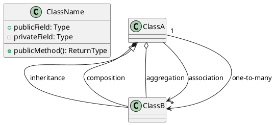
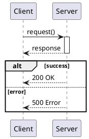
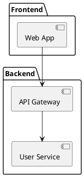

# UML Generation Skill
**Version:** v0.22.0
**Source:** Skills/uml-generation/SKILL.md

---
name: uml-generation
description: Generate UML diagrams from project source code using PlantUML with online rendering
---
## Purpose
Analyze project source code and generate UML diagrams with PlantUML syntax and online rendering URLs. Provides visual documentation during code analysis.
## When to Invoke
- **Code analysis** requiring visual documentation
- **Architecture review** and documentation
- **Reverse-engineering** existing codebases
- **Understanding class hierarchies**
- **Documenting API call flows**
- **Technical debt visualization** (with anti-pattern-analysis)
- **PRD extraction** (with extract-prd skill)
## Supported Diagram Types
| Diagram | Use Case | Priority |
|---------|----------|----------|
| **Class Diagram** | Code structure, inheritance, associations | High |
| **Sequence Diagram** | Method call flows, API interactions | High |
| **Component Diagram** | Architecture, module dependencies | Medium |
| **Activity Diagram** | Workflow logic, algorithms | Medium |
| **State Diagram** | State machines, lifecycle | Low |
## Output Format
Each generated diagram includes:
1. **PlantUML Source** (copyable)
2. **Online Rendering URL:** `http://www.plantuml.com/plantuml/svg/[encoded]`
3. **Download Links:** SVG and PNG formats
## PlantUML Quick Reference
### Class Diagram

### Sequence Diagram

### Component Diagram

## URL Encoding
PlantUML uses: UTF-8 encode -> Deflate compress -> Base64-like encode -> Construct URL
**URL Length Limit:** ~2000 characters. For larger diagrams, output source only.
## Integration Points
| Integration | Workflow |
|-------------|----------|
| **extract-prd** | Create class/component diagrams during code analysis |
| **anti-pattern-analysis** | Visualize problematic classes |
| **Backend-Specialist** | Service layer class diagrams |
| **API-Integration-Specialist** | Sequence diagrams for API flows |
## Limitations (Phase 1)
| Limitation | Workaround |
|------------|------------|
| Internet required | Use PlantUML locally |
| URL length ~2000 chars | Output source only for large diagrams |
| Public server | Self-host for sensitive code |
## Resources
See `resources/` directory for diagram guides, encoding details, and language-specific patterns.
## Related
- **extract-prd**: Code analysis for PRD extraction
- **anti-pattern-analysis**: Code quality visualization
---
**End of Skill Document**
