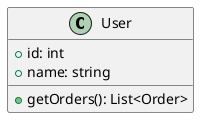
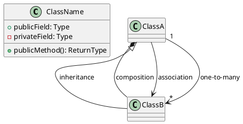
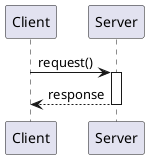
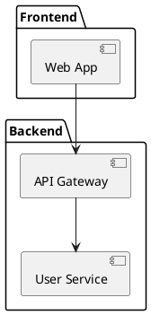

# UML Generation Skill
**Version:** v0.23.0

---
name: uml-generation
description: Generate UML diagrams from project source code using PlantUML with online rendering
---

## Purpose

Analyze project source code and generate UML diagrams with PlantUML syntax and online rendering URLs.

## When to Invoke

- Code analysis requiring visual documentation
- Architecture review and documentation
- Reverse-engineering existing codebases
- Understanding class hierarchies

## Supported Diagram Types

| Diagram | Use Case | Priority |
|---------|----------|----------|
| **Class Diagram** | Code structure, inheritance | High |
| **Sequence Diagram** | Method call flows, API interactions | High |
| **Component Diagram** | Architecture, module dependencies | Medium |
| **Activity Diagram** | Workflow logic, algorithms | Medium |

## Output Format

### 1. PlantUML Source (Copyable)


### 2. Online Rendering URL
```
View: http://www.plantuml.com/plantuml/svg/[encoded]
```

### 3. Download Links
```
SVG: http://www.plantuml.com/plantuml/svg/[encoded]
PNG: http://www.plantuml.com/plantuml/png/[encoded]
```

## PlantUML Quick Reference

### Class Diagram


### Sequence Diagram


### Component Diagram


## URL Encoding

PlantUML uses custom encoding:
1. UTF-8 encode the source
2. Deflate compress
3. Base64-like encode
4. Construct URL: `http://www.plantuml.com/plantuml/svg/{encoded}`

**URL Length Limit:** ~2000 characters

## Limitations

| Limitation | Workaround |
|------------|------------|
| Internet required | Use PlantUML locally |
| URL length ~2000 chars | Output source only |
| Public server | Self-host |

## Resources

- [Class Diagram Guide](resources/class-diagram-guide.md)
- [Sequence Diagram Guide](resources/sequence-diagram-guide.md)
- [Component Diagram Guide](resources/component-diagram-guide.md)
- [PlantUML Encoding](resources/plantuml-encoding.md)

---

**End of Skill Document**
